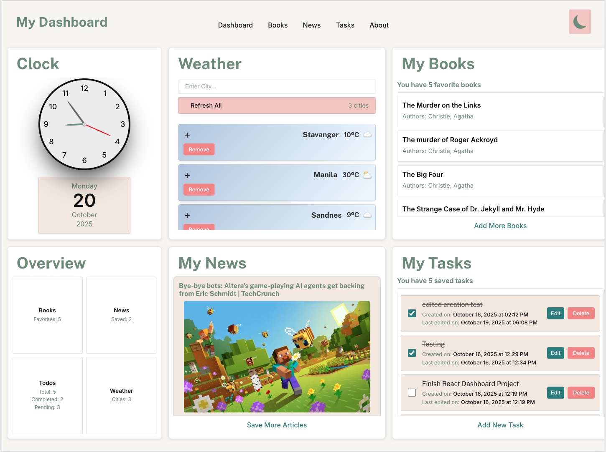
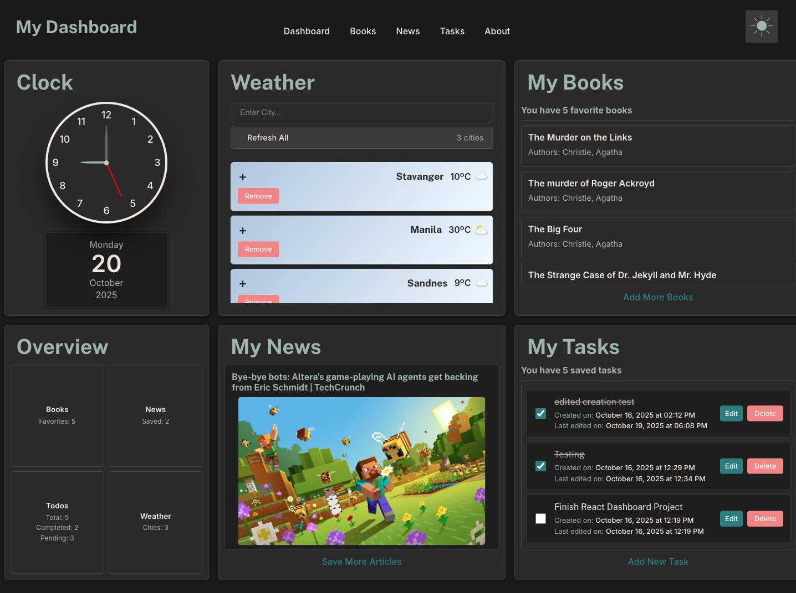

# React Personal Dashboard

A responsive personal dashboard built with React featuring real-time weather, news, book search, and task management.




## 🎯 Features

- **Weather Widget** - Track multiple cities with auto-refresh and real-time updates
- **News Feed** - Browse and save articles by category or search (powered by NewsAPI)
- **Book Library** - Search and save favorite books from Project Gutenberg
- **Todo Manager** - Create, filter, and manage tasks with local persistence
- **Overview** - Quick stats summary of all your saved items
- **Live Clock** - Analog clock with current date display
- **Dark/Light Theme** - Toggle between themes with persistent preference

## 🛠️ Tech Stack

**Frontend:**

- React 19
- React Router
- CSS Modules
- Vite

**APIs:**

- [NewsAPI](https://newsapi.org/) - News articles
- [Gutendex](https://gutendex.com/) - Book data from Project Gutenberg
- [Open-Meteo](https://open-meteo.com/) - Weather data

**Backend:**

- Vercel Serverless Functions (NewsAPI proxy)

**Storage:**

- LocalStorage for data persistence

## 🚀 Live Demos

- **GitHub Pages:** [https://lyn-kodehode.github.io/React-personal-dashboard/](https://lyn-kodehode.github.io/React-personal-dashboard/)
- **Vercel (Full-Stack):** [https://react-personal-dashboard-seven.vercel.app](https://react-personal-dashboard-seven.vercel.app)

> **Note:** The News feature requires the Vercel deployment to work (serverless function for API proxy).

## 💻 Local Development

```bash
# Install dependencies
npm install

# Run development server
npm run dev

# Build for production
npm run build
```

## 📦 Deployment

**GitHub Pages:**

```bash
npm run build
npm run deploy
```

**Vercel:**

```bash
vercel --prod
```

## 🔑 Environment Variables

For local development with Vercel functions:

```env
NEWS_API_KEY=your_newsapi_key_here
```

## 📱 Responsive Design

- **Mobile:** Single column layout (< 768px)
- **Tablet:** 2-column grid (768px - 1200px)
- **Desktop:** 3-column grid (> 1200px)

## 🎨 Features Highlights

- **Auto-sync widgets** - Data updates across all widgets in real-time
- **Smart caching** - Weather data cached for 10 minutes
- **Responsive grids** - Adapts to any screen size
- **Persistent state** - All data saved locally
- **CORS-friendly** - Serverless proxy for NewsAPI

---

Built with ❤️ using React & Vite
